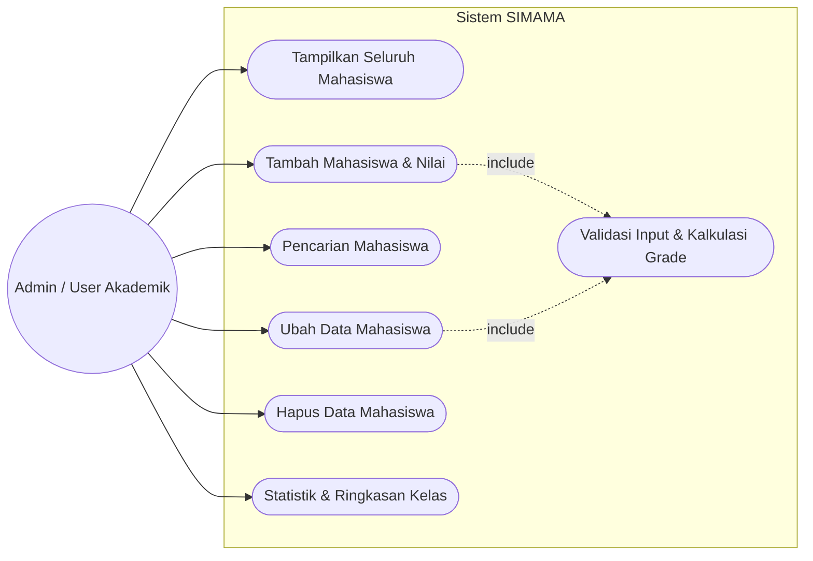
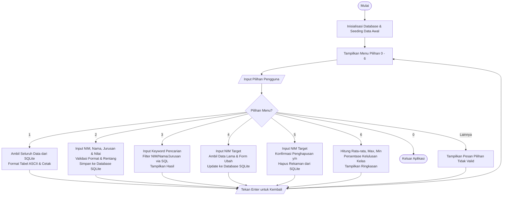
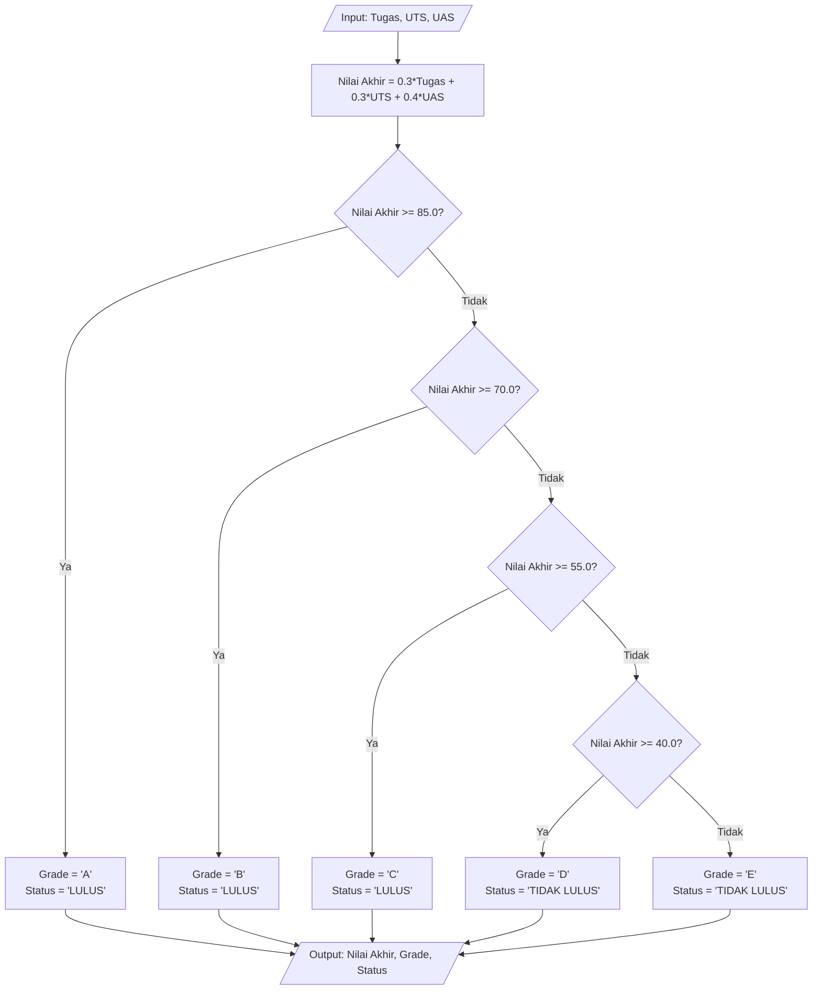
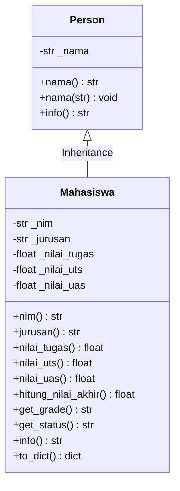

# DOKUMEN DIAGRAM ALUR (FLOWCHART) & USE CASE
## Sistem Manajemen Data Mahasiswa & Transkrip Nilai (SIMAMA)
**Skema Sertifikasi:** Pemrograman / Software Development (BNSP)  
**Unit Kompetensi:** Mengimplementasikan Spesifikasi Program & Pemrograman Terstruktur

---

## 1. Use Case Diagram

Diagram Use Case memodelkan interaksi antara Aktor (Admin Akademik / Dosen) dengan fungsi-fungsi utama yang disediakan oleh sistem SIMAMA.

### Deskripsi Use Case:
1. **Tampilkan Seluruh Mahasiswa**: Membaca basis data dan menyajikan tabel lengkap mahasiswa beserta nilai akhir dan predikat grade.
2. **Tambah Mahasiswa**: Menerima input data baru, memvalidasi format, melakukan enkapsulasi objek `Mahasiswa`, dan menyimpannya ke database SQLite.
3. **Pencarian Mahasiswa**: Menyaring data berdasarkan kata kunci NIM, Nama, atau Jurusan dengan klausa SQL `LIKE`.
4. **Ubah Data**: Mengambil rekaman data lama, memungkinkan pengguna memperbarui nama, jurusan, atau nilai, serta menghitung ulang nilai akhir dan grade.
5. **Hapus Data**: Menghapus rekaman berdasarkan NIM dengan dialog konfirmasi keselamatan.
6. **Statistik Kelas**: Mengagregasi data kelas (rata-rata, tertinggi, terendah, persentase kelulusan).

---

## 2. Flowchart Alur Program Utama (Interactive CLI)

Diagram alur berikut menggambarkan jalannya aplikasi sejak dijalankan hingga pengguna keluar.

---

## 3. Flowchart Logika Validasi & Kalkulasi Nilai (Subprogram)

Diagram alur berikut menggambarkan alur logika terstruktur pada fungsi penentuan Grade dan Kelulusan:

---

## 4. Class Diagram (Pemrograman Berorientasi Objek - OOP)

Menerapkan pilar OOP: **Inheritance**, **Encapsulation**, dan **Polymorphism**.

