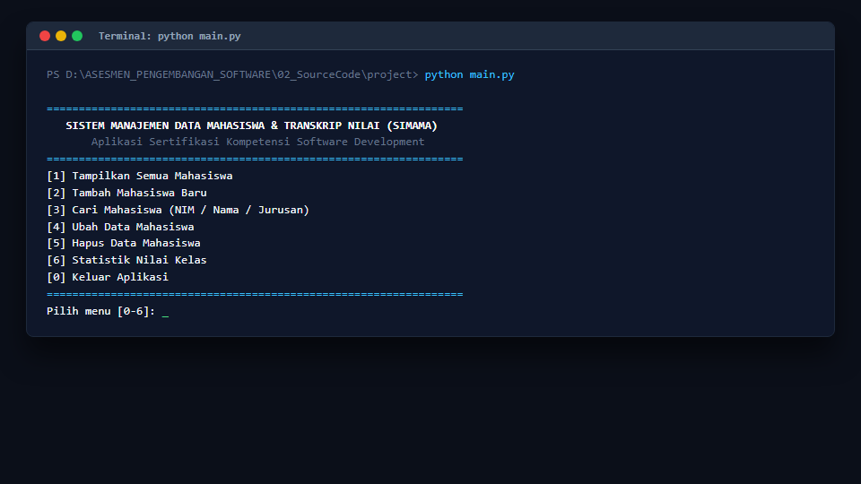
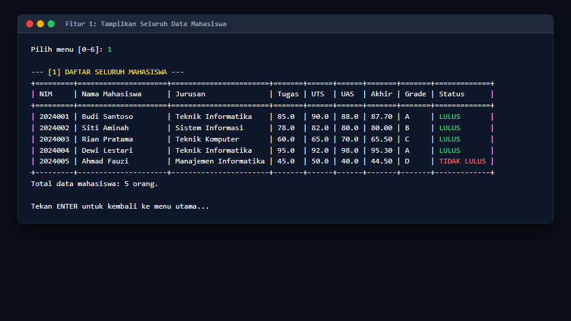
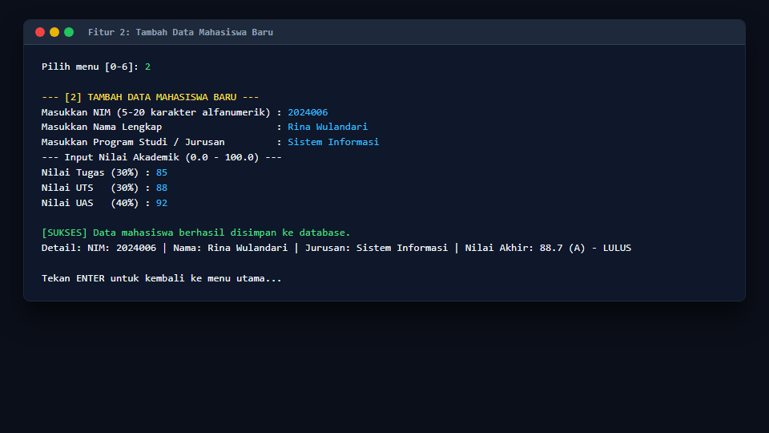
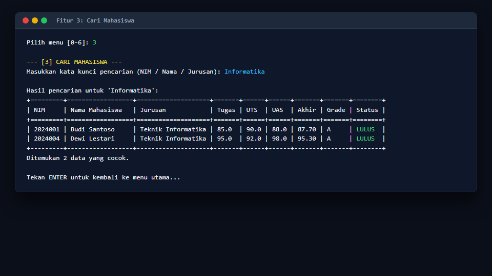
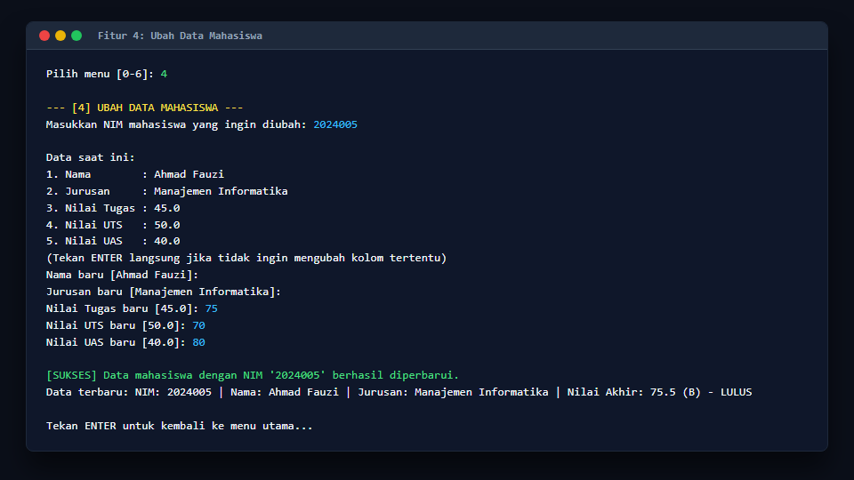
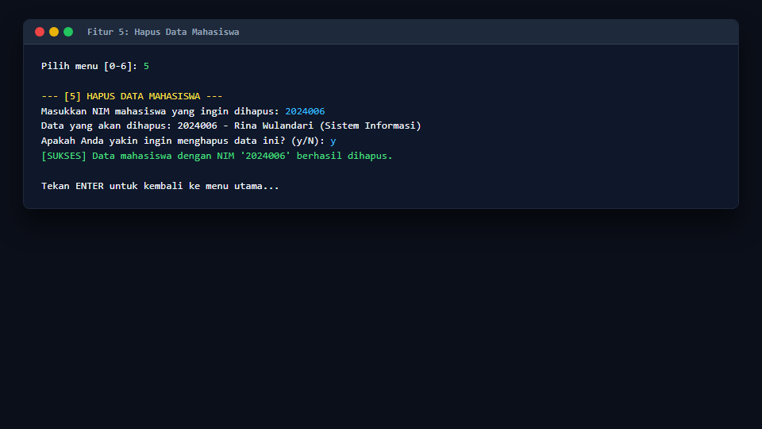
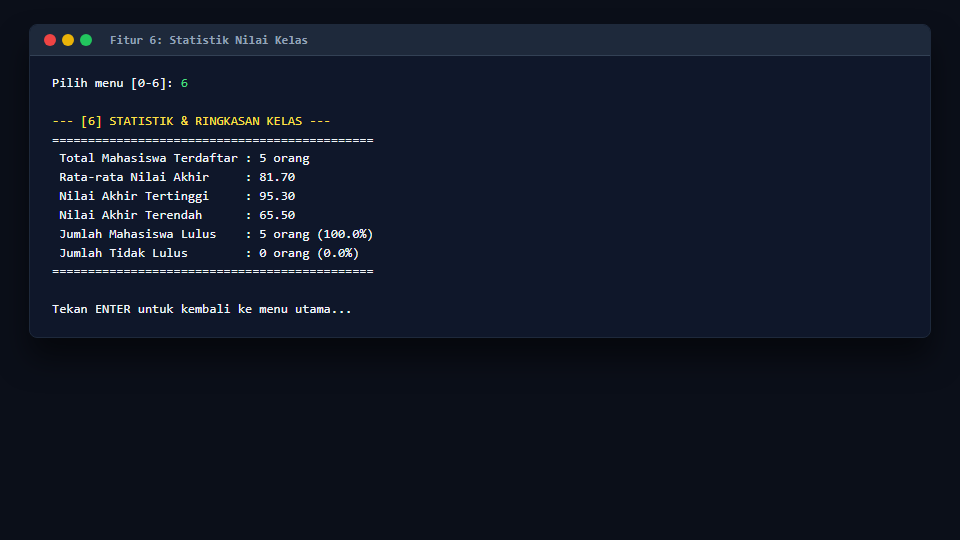
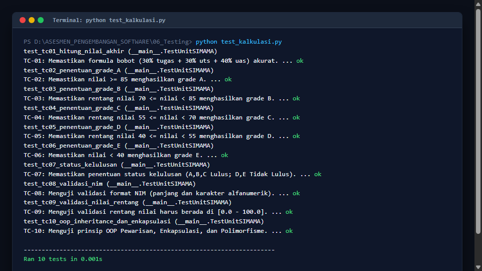

# Sistem Manajemen Data Mahasiswa & Transkrip Nilai (SIMAMA)

[](https://www.python.org/)
[](https://www.sqlite.org/)
[]()
[]()
[]()

> **Aplikasi CLI Manajemen Data Mahasiswa & Transkrip Nilai Akademik**  
> Proyek uji kompetensi sertifikasi profesi skema **Pemrograman / Software Development (BNSP)** yang mencakup 100% dari **9 Unit Kompetensi** menggunakan Python murni dan SQLite.

---

## 📌 Ringkasan Proyek

**SIMAMA** adalah aplikasi berbasis Command Line Interface (CLI) yang dibangun untuk mencatat data induk mahasiswa, mengelola nilai akademik (Tugas, UTS, UAS), menghitung otomatis Nilai Akhir dengan sistem bobot persentase, menentukan predikat grade mutu (A, B, C, D, E), menentukan status kelulusan, menyajikan ringkasan statistik kelas, serta mendukung operasi CRUD (Create, Read, Update, Delete) yang tersimpan secara permanen pada basis data relasional SQLite.

Proyek ini dirancang secara modular, mematuhi prinsip **Clean Code (PEP 8)**, menerapkan konsep **Pemrograman Berorientasi Objek (OOP)**, dan memiliki sifat **Zero External Dependency** (dapat langsung dijalankan di semua sistem operasi tanpa instalasi paket pihak ketiga via `pip`).

---

## 🏆 Pemetaan 9 Unit Kompetensi BNSP

Seluruh kriteria unjuk kerja dari 9 Unit Kompetensi dipetakan secara terstruktur ke dalam berkas proyek:

| No | Unit Kompetensi | Bukti Implementasi & Lokasi Berkas |
|:---:|:---|:---|
| **1** | **Mengimplementasikan Spesifikasi Program** | Dokumen spesifikasi kebutuhan fungsional & non-fungsional, use case, flowchart, dan kamus data tabel.<br>📄 [`Requirement.pdf`](ASESMEN_PENGEMBANGAN_SOFTWARE/01_Spesifikasi/Requirement.pdf) & [`Flowchart_UseCase.pdf`](ASESMEN_PENGEMBANGAN_SOFTWARE/01_Spesifikasi/Flowchart_UseCase.pdf) |
| **2** | **Menerapkan Perintah Bermakna & Clean Code** | Kode terstruktur modular mematuhi PEP 8 (*snake_case*, *PascalCase*), type hints, docstrings deskriptif, dan bebas dari *over-engineering*.<br>📁 [`02_SourceCode/project/`](ASESMEN_PENGEMBANGAN_SOFTWARE/02_SourceCode/project/) |
| **3** | **Menerapkan Pemrograman Terstruktur** | Alur menu looping (`while True`), percabangan logika grade (`if-elif-else`), dan fungsi modular perhitungan nilai akhir.<br>📄 [`utils.py`](ASESMEN_PENGEMBANGAN_SOFTWARE/02_SourceCode/project/utils.py) |
| **4** | **Menerapkan Pemrograman Berorientasi Objek (OOP)** | Class `Person` (induk) diwarisi oleh `Mahasiswa` (anak), atribut privat dengan `@property` & `@setter` validasi, dan polimorfisme method `info()`.<br>📄 [`models.py`](ASESMEN_PENGEMBANGAN_SOFTWARE/02_SourceCode/project/models.py) |
| **5** | **Menggunakan Library / Komponen Pre-Existing** | Mengoptimalkan library standar Python: `sqlite3` (database), `unittest` (pengujian), `re` (regex validasi NIM), dan generator tabel ASCII konsol.<br>📄 [`utils.py`](ASESMEN_PENGEMBANGAN_SOFTWARE/02_SourceCode/project/utils.py) |
| **6** | **Mengakses Basis Data (CRUD)** | Basis data SQLite lokal (`mahasiswa.db`) dengan query berparameter (`?`) yang aman dari SQL Injection. Fitur: Tambah, Tampil, Cari, Ubah, Hapus.<br>📄 [`database.py`](ASESMEN_PENGEMBANGAN_SOFTWARE/02_SourceCode/project/database.py) & [`database.sql`](ASESMEN_PENGEMBANGAN_SOFTWARE/03_Database/database.sql) |
| **7** | **Membuat Dokumentasi Kode Program** | Docstring pada seluruh modul/fungsi, panduan instalasi & penggunaan, serta galeri bukti tangkapan layar program.<br>📄 [`README.md`](ASESMEN_PENGEMBANGAN_SOFTWARE/04_Dokumentasi/README.md) & 📁 [`Screenshot_Program/`](ASESMEN_PENGEMBANGAN_SOFTWARE/04_Dokumentasi/Screenshot_Program/) |
| **8** | **Melakukan Debugging** | Catatan analisis penanganan runtime error (`ValueError`, `IntegrityError`, `ZeroDivisionError`) via `try-except`, serta prosedur breakpoint di IDE.<br>📄 [`Catatan_Debugging.pdf`](ASESMEN_PENGEMBANGAN_SOFTWARE/05_Debugging/Catatan_Debugging.pdf) |
| **9** | **Melakukan Pengujian Unit (Unit Test)** | 10 skenario pengujian unit otomatis mencakup kalkulasi nilai, grade, validasi, dan OOP (100% PASS), beserta matriks pengujian spreadsheet Excel.<br>📄 [`test_kalkulasi.py`](ASESMEN_PENGEMBANGAN_SOFTWARE/06_Testing/test_kalkulasi.py) & [`TestCase_Hasil.xlsx`](ASESMEN_PENGEMBANGAN_SOFTWARE/06_Testing/TestCase_Hasil.xlsx) |

---

## 📂 Struktur Direktori Repositori

```text
ASESMEN_PENGEMBANGAN_SOFTWARE/
│
├── 01_Spesifikasi/
│   ├── Requirement.pdf             # Dokumen spesifikasi kebutuhan sistem & kamus data
│   ├── Requirement.md              # Source markdown spesifikasi kebutuhan
│   ├── Flowchart_UseCase.pdf       # Diagram alur program, use case, & class diagram
│   └── Flowchart_UseCase.md        # Source markdown flowchart & diagram Mermaid
│
├── 02_SourceCode/
│   └── project/
│       ├── main.py                 # Entry point / Menu navigasi interaktif CLI
│       ├── models.py               # Penerapan OOP (Class Person & Mahasiswa)
│       ├── database.py             # Koneksi SQLite & operasi CRUD (Data Access Object)
│       └── utils.py                # Fungsi validasi input, kalkulasi terstruktur, & format tabel
│
├── 03_Database/
│   ├── database.sql                # DDL script CREATE TABLE & contoh kueri CRUD
│   └── mahasiswa.db                # File basis data SQLite (sudah terisi 5 data contoh)
│
├── 04_Dokumentasi/
│   ├── README.md                   # Dokumentasi teknis proyek
│   └── Screenshot_Program/         # Bukti tangkapan layar hasil eksekusi aplikasi
│       ├── 01_menu_utama.png
│       ├── 02_tampilkan_data.png
│       ├── 03_tambah_mahasiswa.png
│       ├── 04_pencarian_data.png
│       ├── 05_ubah_data.png
│       ├── 06_hapus_data.png
│       ├── 07_statistik_kelas.png
│       └── 08_hasil_unit_testing.png
│
├── 05_Debugging/
│   ├── Catatan_Debugging.pdf       # Laporan analisis penanganan error & breakpoint
│   └── Catatan_Debugging.md        # Source markdown laporan debugging
│
└── 06_Testing/
    ├── test_kalkulasi.py           # Script pengujian unit otomatis (10 test cases)
    ├── TestCase_Hasil.xlsx         # Matriks rekapitulasi hasil uji format Excel
    └── TestCase_Hasil.md           # Matriks hasil uji format Markdown
```

---

## 🚀 Cara Menjalankan Aplikasi

### Persyaratan Sistem
* Python versi 3.8 atau lebih baru.
* Tidak memerlukan instalasi package tambahan (`pip`), karena seluruh modul menggunakan Python Standard Library.

### 1. Menjalankan Program Utama (CLI):
Buka terminal / Command Prompt / PowerShell, lalu jalankan:
```bash
cd ASESMEN_PENGEMBANGAN_SOFTWARE/02_SourceCode/project
python main.py
```

### 2. Menjalankan Pengujian Unit Otomatis (Unit Test):
Untuk menguji logika bisnis, kalkulasi nilai, validasi, dan OOP:
```bash
cd ASESMEN_PENGEMBANGAN_SOFTWARE/06_Testing
python test_kalkulasi.py
```

---

## 📸 Tangkapan Layar Program (Screenshots)

### 1. Menu Navigasi Utama
Tampilan awal saat aplikasi dijalankan dengan menu pilihan nomor 0 s/d 6:


### 2. Tampilkan Seluruh Data Mahasiswa & Nilai
Tabel data mahasiswa lengkap dengan komponen nilai, nilai akhir berbobot, grade, dan status kelulusan:


### 3. Tambah Data Mahasiswa Baru
Form penambahan mahasiswa baru yang dilengkapi validasi format NIM dan batasan angka nilai:


### 4. Pencarian Mahasiswa (Filter)
Pencarian cepat berdasarkan kata kunci NIM, Nama Lengkap, maupun Program Studi:


### 5. Ubah Data Mahasiswa & Nilai
Memperbarui data mahasiswa dengan opsi mempertahankan nilai lama:


### 6. Hapus Data Mahasiswa
Penghapusan data dari basis data dengan dialog konfirmasi persetujuan keamanan (`y/N`):


### 7. Statistik & Ringkasan Nilai Kelas
Perhitungan rata-rata nilai kelas, nilai tertinggi/terendah, dan rasio kelulusan:


### 8. Hasil Eksekusi Unit Testing (10/10 PASS)
Bukti eksekusi 10 skenario pengujian unit otomatis tanpa kegagalan:


---

## 📐 Aturan Bisnis & Logika Akademik

### Formula Nilai Akhir:
$$\text{Nilai Akhir} = (30\% \times \text{Nilai Tugas}) + (30\% \times \text{Nilai UTS}) + (40\% \times \text{Nilai UAS})$$

### Skala Penentuan Grade & Status Kelulusan:
| Rentang Nilai Akhir | Predikat Grade | Bobot Mutu | Status Kelulusan |
|:---:|:---:|:---:|:---:|
| 85.00 - 100.00 | **A** | 4.00 | **LULUS** |
| 70.00 - 84.99 | **B** | 3.00 | **LULUS** |
| 55.00 - 69.99 | **C** | 2.00 | **LULUS** |
| 40.00 - 54.99 | **D** | 1.00 | **TIDAK LULUS** (Remedial) |
| 0.00 - 39.99 | **E** | 0.00 | **TIDAK LULUS** |

---

## 🛠️ Ringkasan Arsitektur & Teknologi

* **Bahasa Pemrograman:** Python 3 (Standar PEP 8)
* **Basis Data:** SQLite 3 (Lokal, ACID Compliant)
* **Paradigma Pemrograman:** 
  * Pemrograman Terstruktur (Modular Functions, Looping, Branching)
  * Pemrograman Berorientasi Objek (Class, Inheritance, Encapsulation, Polymorphism)
* **Testing Framework:** `unittest` (Python Standard Library)
* **Format Dokumen Hasil:** PDF, Markdown, Excel Spreadsheet (.xlsx), SQL Script (.sql), PNG Screenshots.

---

## 📄 Lisensi

Proyek ini dikembangkan untuk keperluan uji kompetensi sertifikasi profesi BNSP dan terbuka untuk digunakan kembali sebagai bahan referensi pembelajaran (*Open Source*).
